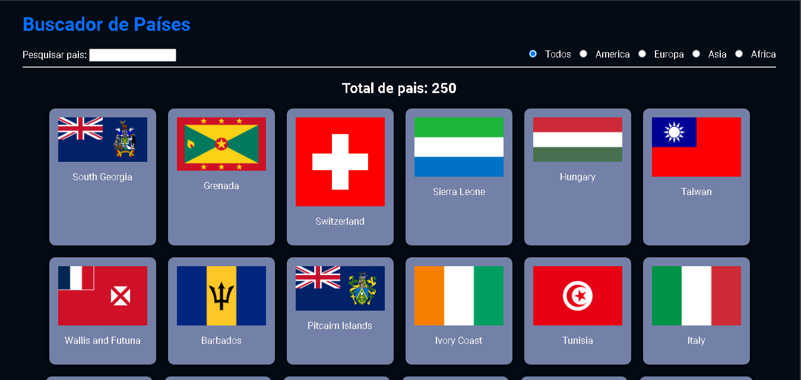
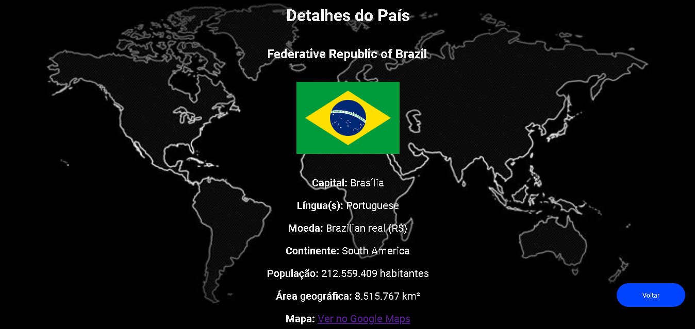
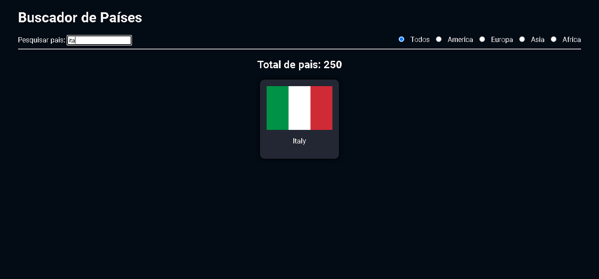

# Buscador de paises

Este projeto utiliza uma API públicas que permite pesquisar países e ver detalhes sobre eles. A API pode se encontrada no link: https://restcountries.com/ 

## Funcionalidades 

- Pesquisar países por nome.
- Filtrar países por continente (América, Europa, Ásia, África).
- Exibir uma lista de todos os países.
- Exibir informações detalhadas de um país ao clicar nele.
- Exibir detalhes como: nome oficial, bandeira, capital, língua, moeda, continente, população, área e link para o Google Maps.

## Desgin do Projeto
### Página Pricipal



### Página Secundária



### Pesquisando País pelo nome



# APIs Públicas Usadas

Para buscar um país pode-se usar a seguinte URL:
```
https://restcountries.com/v3.1/all
```

# Resposta da API:
```
"name": {
            "common": "Colombia",
            "official": "Republic of Colombia",
            "nativeName": {
                "spa": {
                    "official": "República de Colombia",
                    "common": "Colombia"
                }
            }
        },
        "tld": [
            ".co"
        ],
        "cca2": "CO",
        "ccn3": "170",
        "cca3": "COL",
        "cioc": "COL",
        "independent": true,
        "status": "officially-assigned",
        "unMember": true,
        "currencies": {
            "COP": {
                "name": "Colombian peso",
                "symbol": "$"
            }
        },
        "idd": {
            "root": "+5",
            "suffixes": [
                "7"
            ]
        },
        "capital": [
            "Bogotá"
        ],
        "altSpellings": [
            "CO",
            "Republic of Colombia",
            "República de Colombia"
        ],
        "region": "Americas",
        "subregion": "South America",
        "languages": {
            "spa": "Spanish"
        },
        "latlng": [
            4,
            -72
        ],
        "landlocked": false,
        "borders": [
            "BRA",
            "ECU",
            "PAN",
            "PER",
            "VEN"
        ],
        "area": 1141748,
        "demonyms": {
            "eng": {
                "f": "Colombian",
                "m": "Colombian"
            },
            "fra": {
                "f": "Colombienne",
                "m": "Colombien"
            }
        },
        "flag": "🇨🇴",
        "maps": {
            "googleMaps": "https://goo.gl/maps/zix9qNFX69E9yZ2M6",
            "openStreetMaps": "https://www.openstreetmap.org/relation/120027"
        },
        "population": 50882884,
        "gini": {
            "2019": 51.3
        },
        "fifa": "COL",
        "car": {
            "signs": [
                "CO"
            ],
            "side": "right"
        },
        "timezones": [
            "UTC-05:00"
        ],
        "continents": [
            "South America"
        ],
        "flags": {
            "png": "https://flagcdn.com/w320/co.png",
            "svg": "https://flagcdn.com/co.svg",
            "alt": "The flag of Colombia is composed of three horizontal bands of yellow, blue and red, with the yellow band twice the height of the other two bands."
        },
        "coatOfArms": {
            "png": "https://mainfacts.com/media/images/coats_of_arms/co.png",
            "svg": "https://mainfacts.com/media/images/coats_of_arms/co.svg"
        },
        "startOfWeek": "monday",
        "capitalInfo": {
            "latlng": [
                4.71,
                -74.07
            ]
        }
```